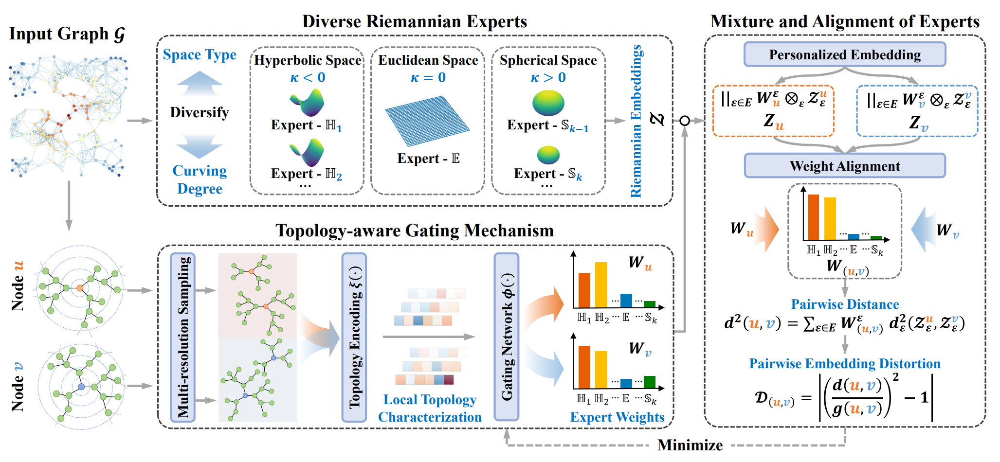

# [AAAI 2025] GraphMoRE: Mitigating Topological Heterogeneity via Mixture of Riemannian Experts


This repository is the official implementation of "GraphMoRE: Mitigating Topological Heterogeneity via Mixture of Riemannian Experts" accepted by the Main Technical Track of the 39th Annual AAAI Conference on Artificial Intelligence (AAAI-2025).

<p align="center">

</p>

-----


### Environment

```
python==3.8.0
cuda==11.7
torch==1.13.1
torch-geometric==2.3.1
networkx==3.0.0
geoopt==0.5.0
```


### Training Examples

To run link prediction on the Pubmed:
```
python3 main.py --downstream_task LP --dataset Pubmed --hidden_features 32 --embed_features 16 --lr_Riemann 0.01 --lr_gating 0.001 --w_decay 0.0 --w_decay_gating 0.0 --coef_dis 1 --exp_iters 10
```
Or:
```
bash scripts/LP/pubmed.sh
```


To run node classification on the Photo with SAGE backbone
```
python3 main.py --downstream_task NC --dataset photo --backbone sage --hidden_features 32 --embed_features 32 --hidden_features_cls 32 --lr_Riemann 0.01 --lr_gating 0.01 --w_decay 0.0005 --w_decay_gating 0.0005 --min_epoch_cls 200 --lr_cls 0.01 --w_decay_cls 0.0005 --drop_cls 0.0 --drop_edge_cls 0.0 --sample_hop 1 --exp_iters 10
```
Or:
```
bash scripts/NC/sage/photo.sh
```

### Citation
If you find this repository helpful, please consider citing the following paper. We welcome any discussions with [guozh@act.buaa.edu.cn](mailto:guozh@act.buaa.edu.cn).

```bibtex
@article{guo2024graphmore,
  title={GraphMoRE: Mitigating Topological Heterogeneity via Mixture of Riemannian Experts},
  author={Guo, Zihao and Sun, Qingyun and Yuan, Haonan and Fu, Xingcheng and Zhou, Min and Gao, Yisen and Li, Jianxin},
  journal={arXiv preprint arXiv:2412.11085},
  year={2024}
}
```

### Acknowledgements
Part of this code is inspired by [MotifRGC](https://github.com/RiemannGraph/MotifRGC), [ACE-HGNN](https://github.com/RingBDStack/ACE-HGNN) and [HGCN](https://github.com/HazyResearch/hgcn). We owe sincere thanks to their valuable efforts and contributions.
